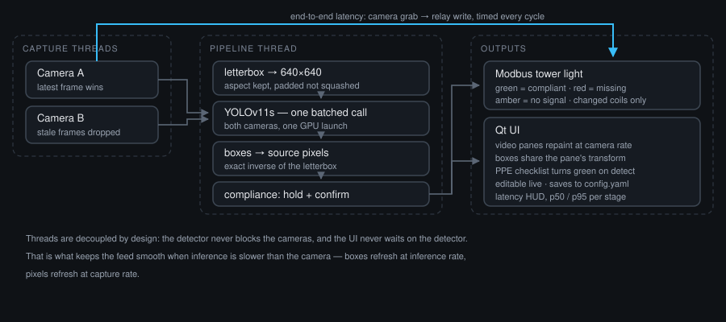

# PPE Detection Station

Two camera feeds → YOLOv11s → a Modbus tower light, with a live checklist of the
PPE each class is or is not wearing.



- **Two cameras, one inference.** Both frames go into a single batched
  `predict`, so the GPU is launched once per cycle instead of twice.
- **Smooth video.** Capture, inference and drawing run on separate threads. The
  panes repaint at camera rate no matter how slow the model is, and stale frames
  are dropped rather than queued — the feed stays live instead of drifting
  further behind the longer it runs.
- **Boxes that land where the objects are.** Frames are letterboxed (scaled by
  one factor and padded, never squashed) and every box is mapped back through
  the exact inverse. Capture and inference sizes are free to change.
- **An editable checklist.** Required PPE is listed in the UI; each row turns
  green the moment its class is detected. Toggle, add, remove or re-threshold a
  class and it takes effect on the next frame — no restart.
- **Latency you can see.** Every cycle is timed from the camera grab to the
  relay write, broken down per stage, shown in the HUD and appended to CSV.
  `--profile` adds a cProfile hotspot report covering the worker threads.

## Install

```bash
pip install -r requirements.txt
```

`yolo11s.pt` downloads itself on first run. Swap in your own PPE-trained
weights via `model.weights` in `config.yaml` — the stock COCO model does not
know what a hard hat is (see [Choosing a model](#choosing-a-model)).

## Run

```bash
python main.py                     # the UI, on the cameras in config.yaml
python main.py -c other.yaml       # a different config
python main.py --headless          # no UI; prints the latency breakdown
python main.py --profile           # add a hotspot report on exit
python main.py --headless --seconds 30 --profile   # a fixed benchmark run
```

## Configure

Everything lives in `config.yaml`, and the parts you tune most often are also
editable in the UI (the checklist's **Save to config** button writes them back).

| Key | What it does |
| --- | --- |
| `model.weights` | Any YOLOv11 `.pt`, `.onnx` or TensorRT `.engine` |
| `model.imgsz` | Inference size, a multiple of 32. Lower = faster, worse on small objects |
| `model.device` | `auto`, `cpu`, `cuda:0`, `mps` |
| `model.half` | fp16 on CUDA — usually ~1.5-2x faster, no measurable accuracy cost |
| `cameras[].source` | Camera index, RTSP/HTTP URL, or a video file |
| `cameras[].width/height` | Requested capture size (see below) |
| `ppe.classes[].required` | Only required classes drive the tower light |
| `ppe.classes[].conf` | Per-class confidence floor, overriding `model.conf` |
| `ppe.hold_ms` | How long a class stays "present" after its last sighting |
| `ppe.confirm_frames` | Agreeing cycles before the lamp changes |
| `tower.*` | Transport, address, and the coil behind each lamp |
| `telemetry.csv` | Per-cycle latency log; empty string disables |

### Capture size and accuracy

Capture resolution and `imgsz` are independent, and changing either is safe:
frames are scaled by a single factor and padded to a square, so nothing is
distorted, and `INTER_AREA` is used when shrinking so small objects survive the
downscale. What actually costs accuracy is **effective object size in pixels**:

- Raising capture resolution above `imgsz` buys nothing on its own — the frame
  is scaled down to `imgsz` before inference either way. It does cost bandwidth
  and decode time.
- Lowering `imgsz` is the real trade. 640 is the trained default; 480 or 416 is
  noticeably faster and starts to miss small or distant items. Measure it on
  your own footage rather than guessing.
- If workers are far from the camera, prefer a tighter lens or a higher `imgsz`
  over a higher capture resolution.

`tests/test_detector.py` pins this down: the same scene captured at 0.5x, 0.75x
and 1.5x yields the same detections in the same places, to within 3% of the
frame.

### Choosing a model

The stock `yolo11s.pt` is trained on COCO, whose 80 classes include `person`
but no PPE. For real use, point `model.weights` at a model trained on your PPE
classes and list those class names in `ppe.classes`. Any name the model does not
have is flagged amber in the UI and forces the tower to `DEGRADED` rather than
silently passing — a class that can never be detected must never read as
compliant.

## The tower light

| Status | Lamp | Meaning |
| --- | --- | --- |
| `OK` | green | Every required class is present |
| `VIOLATION` | red | At least one required class is missing |
| `DEGRADED` | amber | No usable video, or a required class the model lacks |

Detections are unioned across cameras: an item seen by either camera counts as
present, which is what you want when two cameras view one cell.

Two guards keep the relay from chattering: `hold_ms` bridges a class that
flickers out for a frame or two, and `confirm_frames` requires several agreeing
cycles before the lamp changes. Only coils that actually changed are written,
and a bus that drops out is retried in the background without stalling
detection — the UI says `tower offline` while that lasts.

Wiring is `tower.coils`: a Modbus coil address per lamp. Set
`tower.transport: rtu` with `serial_port`/`baudrate` for a serial relay, or
`tcp` with `host`/`port` for an Ethernet one. `tower.enabled: false` runs the
whole app with no bus at all, which is how the tests and a dev laptop run.

## Latency and profiling

Latency is measured **from the camera grab**, not from the start of inference,
so it is the number that matters — how stale the lamp is relative to the world.

```
stage          p50 ms   p95 ms   max ms   share      n
wait             3.95     6.83     7.72    0.9%     58
preprocess       1.43     2.11     3.38    0.3%     58
inference      414.46   443.78   483.71   98.6%     58
postprocess      0.26     0.50     0.50    0.1%     58
logic            0.03     0.06     0.20    0.0%     58
relay            0.00     0.01     0.04    0.0%     58
------------------------------------------------------
end-to-end     417.75   450.92   491.10  100.0%     58
```

| Stage | Covers |
| --- | --- |
| `wait` | Grab → the pipeline picking the frame up |
| `preprocess` | Letterbox and batch |
| `inference` | The forward pass and NMS |
| `postprocess` | Boxes back to source pixels, per-class thresholds |
| `logic` | Compliance state machine |
| `relay` | The Modbus write |
| `render` | UI repaint (main thread, shown in the HUD) |

The HUD shows this live, `telemetry.csv` records every cycle for offline
analysis, and `telemetry.print_every` prints it to the console on an interval.

`--profile` writes `logs/profile.prof` and prints the top functions by self time
and by cumulative time. cProfile is per-thread, so the pipeline thread opts
itself in — without that, the profile would show only an idle main thread. Dig
in further with:

```bash
python -m pstats logs/profile.prof
pip install snakeviz && snakeviz logs/profile.prof
```

(The run above is CPU-only inference on a container — `inference` at 98.6% is
exactly what you would expect. On a GPU it drops to a few milliseconds and the
other stages start to matter.)

## Layout

```
main.py              CLI entry point
config.yaml          all configuration
ppe/
  config.py          typed config, load/save/validate
  capture.py         one thread per camera, latest frame wins
  letterbox.py       aspect-preserving resize + the exact box inverse
  detector.py        YOLOv11, both cameras in one batched call
  tower.py           compliance state machine + Modbus tower light
  pipeline.py        the loop tying it together
  latency.py         per-stage timing, CSV, thread-aware profiler
  ui.py              Qt: video panes, editable checklist, latency HUD
tests/               134 tests
```

## Tests

```bash
pip install pytest ruff
pytest                       # 134 tests
ruff check ppe main.py tests
```

The suite runs without a camera, a GPU, a display or a Modbus device: cameras
are synthetic video files, the UI runs on Qt's offscreen platform, and the bus
is a fake that records coil writes. `tests/test_detector.py` does use the real
model — including a check that our box inverse agrees with Ultralytics' own
`scale_boxes` to within half a pixel — and skips itself if the weights are not
available.
