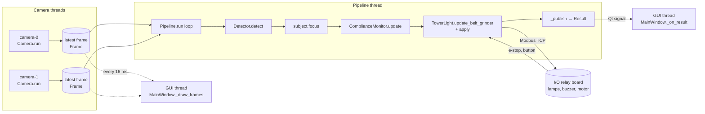
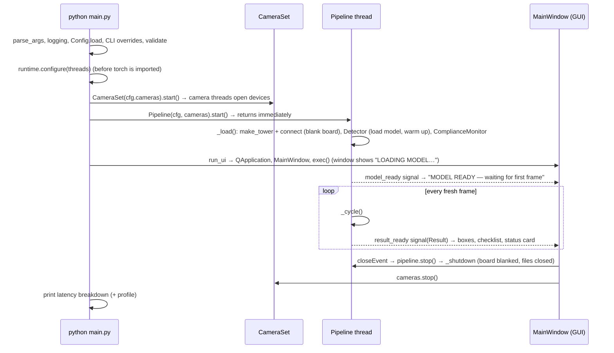

# How the code works

A guided tour of the PPE detection station: what runs, in what order, which
function calls which, what data moves between them, and why each piece is
written the way it is.

**How to read this.** Part 1 is the big picture: the threads, and one cycle
from camera to relay. Part 2 describes the data structures that move through
that cycle. Part 3 goes module by module and covers **every class and
function**. For the parts that decide whether the machine runs, it goes
**line by line**: the compliance state machine, the motor interlock, the
letterbox maths, the camera loop and the pipeline loop. Part 4 follows a real
event through the code with timings. Part 5 maps every `config.yaml` key to
the code that reads it.

File references use `path:line`. Line numbers are as of this commit and will
drift as the code changes; the function names will not.

---

## Contents

1. [The big picture](#1-the-big-picture)
2. [The data that moves through the system](#2-the-data-that-moves-through-the-system)
3. [Module by module](#3-module-by-module)
   - [main.py](#31-mainpy--the-entry-point)
   - [config.py](#32-ppeconfigpy--typed-configuration)
   - [runtime.py](#33-ppruntimepy--cpu-thread-budget)
   - [capture.py](#34-ppecapturepy--camera-threads)
   - [letterbox.py](#35-ppeletterboxpy--resize-without-distortion)
   - [detector.py](#36-ppedetectorpy--the-model)
   - [subject.py](#37-ppesubjectpy--who-is-being-checked)
   - [tower.py: ComplianceMonitor](#38-ppetowerpy-part-1--complianceMonitor)
   - [tower.py: lamps and TowerLight](#39-ppetowerpy-part-2--lamps-and-the-modbus-board)
   - [pipeline.py](#310-ppepipelinepy--the-loop-that-ties-it-together)
   - [annunciator.py](#311-ppeannunciatorpy--the-spoken-prompt)
   - [latency.py](#312-ppelatencypy--timing-and-profiling)
   - [dataset.py](#313-ppedatasetpy--capture-mode)
   - [trials.py](#314-ppetrialspy--commissioning-evidence)
   - [ui.py](#315-ppeuipy--the-window)
   - [export.py, bench.py, camcheck.py](#316-the-command-line-tools)
4. [Worked examples: following real events through the code](#4-worked-examples)
5. [Config key → code map](#5-config-key--code-map)
6. [Tests: where each behaviour is pinned down](#6-tests)
7. [Glossary](#7-glossary)

---

## 1. The big picture

### 1.1 What the program does, in one paragraph

Two cameras film the operator. A YOLOv11s neural network finds PPE items and
people in each frame. The code picks the person standing at the machine
(the *subject*), keeps only the equipment on that person, counts it, and
compares it with the required list in `config.yaml`. The result is one of
four statuses: **OK**, **VIOLATION**, **STANDBY** (nobody there) or
**DEGRADED** (can't judge). The status is smoothed so it doesn't flicker,
then drives two things over Modbus: the tower lamp and buzzer, and the
motor's run permission. That permission is a latch that only a button press
can set. Everything is shown live in a Qt window.

### 1.2 The threads

The program runs several threads at once, so that a slow stage never holds
up a fast one.

| Thread | Created in | Runs | Hands its output to |
|---|---|---|---|
| **Main / GUI** | `main.py` | Qt event loop: paints video, applies results, handles clicks | the screen |
| **camera-0, camera-1** | `capture.Camera` | read frames as fast as the camera delivers | a one-slot "latest frame" box (`Camera._frame`) |
| **pipeline** | `pipeline.Pipeline` | load the model, then loop: detect → judge → drive relay | a `Result` object, sent to the GUI by a Qt signal |
| **dataset** (capture mode only) | `dataset.DatasetRecorder` | encode and write JPEGs and label files | disk |



Two design rules run through all of this:

1. **Latest frame wins.** Each camera keeps only its newest frame. If the
   detector is busy, older frames are dropped, not queued. A queue would make
   the system fall further behind real time the longer it runs.
2. **Video and detection are independent.** The GUI repaints camera frames
   every 16 ms straight from the camera threads (`_draw_frames`). Detection
   boxes arrive separately, when the pipeline finishes a cycle
   (`_on_result`). So the video stays smooth even when the model runs at
   15 fps.

### 1.3 Startup to shutdown



### 1.4 One cycle, in one sentence per step

This is what `Pipeline._cycle` does for every fresh frame. Each step is
explained in detail in Part 3.

1. **Pick frames.** `Pipeline._take` chooses which fresh frame(s) to run.
   On a CPU that's one camera per cycle, taking turns.
2. **Letterbox.** `letterbox.letterbox` scales each frame into a 640×640
   square without squashing it, and remembers how to map boxes back.
3. **Detect.** `Detector._predict` runs YOLO. `Detector._decode` turns raw
   boxes into `Detection(name, conf, xyxy)` in the original frame's pixels,
   dropping anything under that class's confidence floor.
4. **Focus.** `subject.focus` picks the largest person in each camera view
   and keeps only detections that sit on them. Bystanders and their PPE are
   set aside.
5. **Count and judge.** `ComplianceMonitor.update` counts each item using the
   best single camera view, applies the hold and occlusion windows, and
   decides OK / VIOLATION / STANDBY / DEGRADED. `_debounce` then waits until
   that verdict has stood long enough before the lamp follows it.
6. **Motor.** `TowerLight.update_belt_grinder` reads the e-stop and the push
   button, and sets, keeps or drops the motor latch (including the
   correction countdown).
7. **Lamps.** `TowerLight.apply` writes the tower lamps and buzzer.
8. **Side effects.** The annunciator may speak. Capture mode may keep the
   frame. Latency is recorded.
9. **Publish.** `Pipeline._publish` packs everything into a `Result`. The
   trial log reads it, and the GUI is signalled.

---

## 2. The data that moves through the system

These small classes are the "currency" of the program. They are mostly
`@dataclass(slots=True)`, which means plain records with no behaviour, kept
small and fast.

| Type | Defined in | Fields | Made by | Read by |
|---|---|---|---|---|
| `Frame` | `capture.py:58` | `index` (camera no.), `seq` (frame counter), `image` (BGR numpy array), `ts` (grab time) | `Camera.run` | Pipeline, GUI, dataset |
| `Letterbox` | `letterbox.py:20` | `gain`, `pad_x`, `pad_y`, `src_w`, `src_h` | `letterbox()` | `Letterbox.to_source` |
| `Detection` | `detector.py:19` | `name`, `conf`, `xyxy` (x1,y1,x2,y2 in source pixels) | `Detector._decode` | subject, monitor, UI, dataset |
| `Focus` | `subject.py:46` | `subject` (the chosen person), `accepted`, `rejected` | `subject.focus` | Pipeline → monitor & UI |
| `ClassState` | `tower.py:27` | one row of the checklist: rule (`need`, `expect`, windows) + live state (`count`, `seen`, `last_seen`, …) | `ComplianceMonitor.__init__` | monitor, UI, trials, dataset |
| `Status` | `tower.py:19` | enum: `OK`, `VIOLATION`, `STANDBY`, `DEGRADED` | monitor | everything downstream |
| `Cycle` | `latency.py:28` | stage timings for one frame | `Pipeline._cycle` | `Metrics` |
| `Result` | `pipeline.py:29` | everything the screen needs for one update | `Pipeline._publish` | GUI, `TrialLog` |

**Coordinates.** Every box in the program after `_decode` is in **source-frame
pixels**, for example within 1280×720. The 640×640 model space exists only
inside `detector.py`. That's why the UI and the dataset labels can use boxes
directly.

**Clocks.** `latency.now` is `time.perf_counter`, a monotonic high-resolution
clock. Every timing decision (hold windows, debounce, countdowns) uses it, so
changing the wall clock never affects safety logic. Wall-clock time
(`time.time()`) appears only in CSV logs, for humans.

---

## 3. Module by module

### 3.1 `main.py` — the entry point

**`parse_args(argv)`** (`main.py:26`) defines the command-line flags:

| Flag | Effect |
|---|---|
| `-c/--config` | which YAML file to load (default `config.yaml`) |
| `--headless` | no window; just run and print latency |
| `--profile`, `--profile-out` | cProfile the run and print hotspots |
| `--seconds N` | stop after N seconds (headless) |
| `--debug` / `--operator` | override `ui.mode` |
| `--capture` / `--no-capture` | override `dataset.enabled` |
| `-v` | debug logging, including OpenCV's own native camera log |

**`run_headless(seconds)`** (`main.py:53`) is just a wait. It installs a
Ctrl+C handler that flips a flag, then sleeps in 0.2 s steps until the flag
or the deadline. The real work is already running on the camera and pipeline
threads, so the main thread has nothing else to do.

**`run_ui(cfg, cameras, pipeline)`** (`main.py:64`) imports PySide6 only
here, so `--headless` and `--help` never load Qt. It creates the
`QApplication` and the `MainWindow`, then calls `app.exec()`, which blocks
until the window closes.

**`main(argv)`** (`main.py:75`), line by line:

| Lines | What happens | Why |
|---|---|---|
| 76–81 | parse flags; configure logging | one log format for every module |
| 82–88 | with `-v`, raise OpenCV's native log level | OpenCV prints the real camera error ("device busy") to its own logger, not Python's |
| 90 | `Config.load(args.config)` | YAML → typed dataclasses (§3.2) |
| 91–98 | apply `--debug/--operator/--capture/--no-capture` | CLI beats the file |
| 99 | `cfg.validate()` | stop now on a bad config, before any hardware is touched |
| 100–105 | loud warning if capture mode is on | it photographs people; nobody should miss that it's on |
| 109 | `configure(cfg.model.threads)` | sets thread-count environment variables **before torch is imported**, because the maths libraries read them once at import (§3.3) |
| 111–115 | optional profiler; the main thread is profiled only when it's drawing the UI | profiling a sleeping thread is noise |
| 117 | `CameraSet(cfg.cameras).start()` | camera threads start opening devices immediately |
| 120 | `from ppe.pipeline import Pipeline` | imported late so `--help` and config errors never wait for torch to load |
| 128–129 | build and start the pipeline | construction is cheap; the model loads on the pipeline thread so the window can appear at once |
| 131–140 | headless: wait up to 10 s for frames, then idle. UI: run the window | |
| 141–147 | `finally:` stop the pipeline, stop the cameras, print the latency table and profile | runs even after a crash or Ctrl+C, so the board is always blanked (`TowerLight.close` via `_shutdown`) |

---

### 3.2 `ppe/config.py` — typed configuration

**Why typed?** `config.yaml` is turned into dataclasses so every other module
reads `cfg.tower.grace_sec` rather than `cfg["tower"]["grace_sec"]`. Typos
fail loudly, and every setting has a default in one place.

**`_build(cls, data)`** (`config.py:12`) creates a dataclass from a dict,
**silently ignoring unknown keys**. That's what lets an older or newer
`config.yaml` load without crashing.

The dataclasses, one per YAML section:

| Class | YAML section | Notable logic |
|---|---|---|
| `ModelCfg` | `model:` | `batches(device)` (`:31`): batch both cameras only if asked, or if `auto` and on CUDA. On CPU a batch of 2 costs ~2× and doubles each frame's wait |
| `CameraCfg` | `cameras:` list | `fourcc` defaults to `MJPG` (compressed in-camera; raw 720p is ~55 MB/s per camera, too much for USB 2.0) |
| `ClassCfg` | `ppe.classes:` items | `__post_init__` makes a label from the name if none is given; `forbidden` is `expect == "absent"` |
| `PPECfg` | `ppe:` | `required` lists required classes; `containment_map()` gives per-class containment overrides; `confirm_sec` holds the debounce times |
| `TowerCfg` | `tower:` | Modbus address, coil and input maps, buzzer and grace settings |
| `DatasetCfg` | `dataset:` | capture-mode triggers and limits |
| `UICfg`, `AudioCfg`, `BrandingCfg`, `TelemetryCfg` | matching sections | `BrandingCfg.logo_path()` resolves relative to the config file and returns `None` if the file is missing |
| `Config` | the whole file | holds all of the above plus `path` |

**`Config.load(path)`** (`:266`) reads the YAML with `yaml.safe_load`, which
never executes code from the file. It builds each section with `_build`. The
`ppe.classes` list is built separately because it's a list of dataclasses,
not one.

**`Config.save(path)`** (`:286`) writes the config back (used by the
checklist's **Save to config** button). It drops `None` fields from each
class so the saved file stays as tidy as a hand-written one.

**`Config.base_dir`** (`:296`) is the folder relative paths resolve against:
the config file's folder, not wherever the program was launched from.

**`Config.validate()`** (`:302`) catches mistakes before hardware is touched.
Each check, and the failure it prevents:

| Check | Prevents |
|---|---|
| at least one camera; `imgsz` multiple of 32 | YOLO needs sizes divisible by its stride (32) |
| `ui.mode` is operator/debug; audio times sensible; `threads ≥ 0`; `batch` is true/false/auto | nonsense values reaching the code |
| `ppe.classes` non-empty, names unique | an empty or ambiguous checklist |
| `subject` must also be a listed class | the detector filters to listed classes, so an unlisted subject would never be detected and the station would sit in STANDBY forever |
| `confirm_sec` keys are real statuses, values ≥ 0 | typos like `voilation` silently doing nothing |
| per-class `hold_ms`, `grace_sec`, `occluded_ms` ≥ 0; `containment` in 0–1 | impossible windows |
| `expect` is present/absent; `count ≥ 1`; a forbidden class has `count = 1` | "two wrong sleeves are bad but one is fine" is never meant |
| only known coil and input names | a misspelt coil silently never driven |
| buzzer and grace times ≥ 0; dataset settings sane | |
| **belt grinder all-or-nothing**: `coils.belt_grinder`, `inputs.estop` and `inputs.push_button` must all be set together | a half-wired interlock that looks configured but does nothing on the floor |

---

### 3.3 `ppe/runtime.py` — CPU thread budget

On a CPU, capture, inference and the UI all compete for the same few cores.
OpenCV and the maths libraries each default to "one thread per core",
**per thread that uses them**. A 4-core PC can end up with a dozen busy
threads fighting, and the model running several times slower.

- **`cores()`** (`:23`): the cores this process may actually use. It honours
  Linux CPU affinity and container limits, and falls back to `os.cpu_count()`.
- **`configure(threads)`** (`:31`):
  - sets `OMP_NUM_THREADS`, `MKL_NUM_THREADS` and similar to the inference
    thread count. It uses `setdefault`, so an operator's own setting is never
    overridden;
  - sets `cv2.setNumThreads(1)`: the camera threads already run in parallel,
    so a thread pool inside each one only steals cores from inference;
  - returns the number chosen.

  It must run before torch is imported, which is why `main.py` calls it
  early.
- **`apply_torch(threads)`** (`:48`): once torch is loaded, pins its internal
  pool with `torch.set_num_threads`.

---

### 3.4 `ppe/capture.py` — camera threads

**Line 37, before `import cv2`:**
`os.environ.setdefault("OPENCV_VIDEOIO_MSMF_ENABLE_HW_TRANSFORMS", "0")`.
On Windows, Media Foundation's hardware transforms can make a webcam take
*minutes* to open. Testing showed OpenCV reads this variable when it's
imported, so it has to be set before `import cv2` in this file, not just
before a camera opens. `camcheck.py` imports this module before cv2 for the
same reason.

**`_APIS`** (`:47`) maps the config's `api:` words (`any`, `v4l2`, `dshow`,
`msmf`, …) to OpenCV backend constants. It uses `getattr` so a backend
missing from this OpenCV build falls back to "any" instead of crashing.

**`Frame`** (`:57`): see Part 2. It's `frozen`, so a frame is never modified
after creation, which makes it safe to share between threads.

**`class Camera(threading.Thread)`** (`:65`): one thread per camera, created
as a *daemon* so it can never keep the program alive on exit.

`__init__` sets up a lock-protected slot `_frame`, a stop event `_halt`, a
frame counter `_seq`, a measured `fps`, and a `connected` flag.

**`_open()`** (`:81`), line by line:

| Lines | What | Why |
|---|---|---|
| 82–84 | `"0"` → `0` | YAML may give the index as text; OpenCV needs an int for a device index and a string for a file or URL |
| 85 | `cv2.VideoCapture(src, backend)` | open the device, file or stream |
| 86–96 | if not opened: release, log at debug level, return False | the caller retries with back-off; `-v` shows OpenCV's own reason |
| 104–105 | set **FOURCC first** | on DirectShow/MSMF the pixel format decides which sizes and rates are even offered; setting it after the size can lock in a slow raw mode |
| 107 | `CAP_PROP_BUFFERSIZE = 1` | keep only one frame in the driver; a deeper buffer means showing old frames |
| 108–113 | width, height, fps | ask for the configured mode |
| 114–127 | store the capture; log what the driver *actually* delivered, warning if it ignored the MJPG request | drivers often silently ignore requests |

**`run()`** (`:130`), the camera loop:

| Lines | What | Why |
|---|---|---|
| 131 | `backoff = 0.5` | retry delay after a failed open |
| 135 | `period = 1/fps` | a *file* source reads as fast as the CPU allows, so it's paced manually; a live camera paces itself inside `read()` |
| 136 | loop until `stop()` | |
| 137–144 | if not open: try `_open()`; on failure wait `backoff` (doubling, max 5 s) and retry | unplug and replug recovers by itself |
| 146–149 | pacing wait for file sources | |
| 151–152 | `read()` the next frame; timestamp it **immediately** | this timestamp starts the end-to-end latency clock |
| 153–156 | read failed → release and reconnect | a dropped cable becomes a reconnect, not a crash |
| 158–160 | `seq += 1`; replace `_frame` under the lock | "latest frame wins": the old frame is simply dropped |
| 162–165 | smoothed fps: `fps = 0.9·fps + 0.1·(1/dt)` | an exponential moving average, so the on-screen number doesn't jitter |

The remaining `Camera` methods:

- **`_release()`** closes the device and sets `connected = False`.
- **`stop()`** sets `_halt`, which also wakes any back-off wait, joins the
  thread for up to 2 s, then releases the device.
- **`latest()`** returns the newest `Frame`, or `None`, under the lock.

**`class CameraSet`** (`:185`) handles all cameras as one unit:

- **`start()`**, **`stop()`**: start or stop every camera.
- **`len()`**: the number of cameras.
- **`wait_ready(timeout)`**: polls until every camera has delivered at least
  one frame. Used by headless mode.
- **`sample()`**: one `latest()` per camera, taken back to back.

---

### 3.5 `ppe/letterbox.py` — resize without distortion

The model expects a 640×640 square, but cameras deliver 16:9 frames.
Squashing a frame would distort shapes and hurt accuracy. *Letterboxing*
scales the frame by **one** factor and pads the rest with grey.

**`letterbox(frame, size, scaleup)`** (`:45`), line by line, with a
1280×720 frame and `size = 640` as the example:

| Line | Code | Example |
|---|---|---|
| 47 | `h, w = frame.shape[:2]` | h = 720, w = 1280 |
| 48 | `gain = min(size/h, size/w)` | min(0.889, 0.5) = **0.5**, so the longer side fits exactly |
| 49–50 | `scaleup=False` caps gain at 1 | never enlarge (optional) |
| 52 | new size | 640 × 360 |
| 53 | padding per side | pad_x = 0, pad_y = (640 − 360) / 2 = **140** |
| 55–59 | resize: `INTER_AREA` when shrinking, `INTER_LINEAR` when enlarging | INTER_AREA averages pixels, so small objects like gloves survive the shrink |
| 61 | grey canvas, value **114** | the exact grey Ultralytics trains with; a different pad colour shifts accuracy |
| 62–63 | paste the resized frame in the centre | rows 140–499 |
| 65 | return the canvas and a `Letterbox(gain, left, top, w, h)` | the padding actually applied, so the inverse is exact |

**`Letterbox.to_source(boxes)`** (`:29`) is the exact inverse, applied to all
boxes at once with numpy. For each box it subtracts the padding, divides by
the gain, and clips to the frame. For example, model y = 300 →
(300 − 140) / 0.5 = **320** px in the original frame. The slices
`out[:, 0::2]` (all x values) and `out[:, 1::2]` (all y values) are numpy
*views*, so the arithmetic edits the array in place, with no copies.

**`fit(src_w, src_h, dst_w, dst_h)`** (`:68`) does the same idea for the
screen: it returns the scale and offset that fit a frame inside a widget.
The UI uses it for both the picture and its boxes, so they can never drift
apart when the window is resized.

---

### 3.6 `ppe/detector.py` — the model

**`Detection`** (`:19`): `name`, `conf`, `xyxy`. Frozen.

**`_precision_kwargs(half)`** (`:25`) chooses the fp16 setting in whichever
form the installed Ultralytics understands: `quantize="fp16"` on 8.4+,
`half=True` before that. Using the old name on new versions logs a warning
on every call.

**`resolve_device(want)`** (`:43`): `"auto"` → `cuda:0` if an NVIDIA GPU is
available, then Apple `mps`, otherwise `cpu`.

**`class Detector`** (`:55`):

**`__init__(cfg, ppe)`**:

| Step | Why |
|---|---|
| `from ultralytics import YOLO` inside the method | importing torch takes seconds; doing it here keeps it on the pipeline thread |
| `device`, `half` (fp16 only on CUDA) | fp16 doesn't help on a CPU |
| `configure(threads)` and `apply_torch` on CPU | thread budget (§3.3) |
| `self.batches = cfg.batches(device)` | batch both cameras? (§3.2) |
| `YOLO(cfg.weights)` | loads a `.pt`, an `.onnx` or an OpenVINO folder; Ultralytics picks the runtime from the path |
| `self.names` | the model's `{id: class name}` map |
| `set_classes(ppe)` | which classes to look for (below) |
| `_settle_batching()` | find out what batch size the model really accepts (below) |
| `warmup()` | one dummy prediction, so the first real frame isn't slow |

**`set_classes(ppe)`** (`:89`), which also runs again when the checklist is
edited:

1. Invert `names` to `{name: id}`.
2. `missing` = configured classes the model doesn't have. These are logged,
   and later make the station DEGRADED (it can't judge an item it can't
   detect).
3. `class_ids` = ids of the configured classes. They're passed to YOLO so it
   discards other classes **inside** its NMS step, which is cheaper than
   filtering afterwards.
4. `_floors` = each class's confidence threshold (its own `conf`, or the
   global one).
5. `_conf` = the **lowest** of all floors. YOLO runs at that, and the stricter
   per-class floors are applied in `_decode`. A single YOLO call can't take a
   threshold per class, so this is how per-class thresholds work.

**`_settle_batching()`** (`:109`): an exported model (OpenVINO/ONNX) accepts
exactly the batch size it was exported with. This method:

- tries the wanted batch size on a blank image;
- if that fails but the other size works, flips `self.batches` and logs how
  to fix the config;
- if both fail, the model itself is broken, so it raises the original error.

It also sets `self.exact`: True when a batch-2 export refuses a single frame,
so short calls must be padded (see `_predict_all`). Probing here, at load
time, means a station never starts and then crashes on its first real frame.

**`_refuses(blank, count)`** (`:157`) runs `count` blank frames and returns
the exception, or `None` if it worked.

**`warmup(batch)`** (`:165`) makes one dummy call and logs how long it took.

**`_predict(canvases)`** (`:172`) is the single call into Ultralytics:
`model.predict(canvases, imgsz, conf=_conf, iou, max_det, classes=class_ids,
device, verbose=False, precision)`. YOLO runs the network and **NMS**
(non-maximum suppression, which merges overlapping boxes for the same object
using `iou`).

**`_predict_all(canvases)`** (`:185`): for an exact-batch model, splits the
input into chunks of `batch_size`. A short chunk is padded with copies of its
last frame, and the padding's results are thrown away.

**`detect(images)`** (`:204`) is called once per cycle:

1. `letterbox` each image (timed as `preprocess`);
2. `_predict_all` (timed as `inference`);
3. `_decode` each result back to source pixels (timed as `postprocess`);
4. return `(detections per image, timings)`.

**`_decode(result, meta)`** (`:225`):

- if there are no boxes, return `[]`;
- move all boxes, confidences and class ids from the device to numpy in one
  transfer each;
- map the boxes back with `meta.to_source`;
- for each box: look up the class name, skip it if below that class's floor,
  otherwise create a `Detection`.

---

### 3.7 `ppe/subject.py` — who is being checked

PPE only matters on the person at the machine. Someone walking past in full
PPE must not make a bare-handed operator look compliant.

- **`area(box)`** (`:18`): width × height. A degenerate box has area 0.
- **`overlap(inner, outer)`** (`:23`): the **fraction of `inner` inside
  `outer`**, meaning intersection ÷ area of inner. This is not IoU on
  purpose: a small glove fully inside a large person box scores 1.0, while
  its IoU would be tiny.
- **`largest(detections, name)`** (`:39`): the biggest box of a class. The
  biggest person is the one nearest the camera, which is the operator.
- **`Focus`** (`:46`): `subject`, `accepted`, `rejected`, plus `has_subject`.

**`focus(detections, subject, containment, per_class)`** (`:58`), line by
line:

| Lines | Case | Result |
|---|---|---|
| 76–77 | no `subject` class configured | everything accepted (gating switched off) |
| 79–82 | no person found | nothing accepted, everything kept as rejected for display; the monitor will then say STANDBY |
| 84 | start `accepted` with the chosen person | |
| 85–93 | for every other detection: other *people* are always rejected (bystanders); PPE is accepted only if `overlap(item, person) ≥ need` | |
| 89 | `need` = that class's own containment if set, otherwise the global value | gloves and sleeves stick out past the person box on outstretched arms, so they use a looser threshold (`0.1` / `0.3` in config.yaml) than a mask (`0.5`) |

This runs **per camera** (`Pipeline._cycle`). Each view picks its own
subject, so one camera's choice can't discard the other camera's evidence.

---

### 3.8 `ppe/tower.py` part 1 — `ComplianceMonitor`

This is the brain. It turns noisy per-frame detections into a stable status.

**`Status`** (`:19`) has four values:

- `OK`: the subject is wearing everything required.
- `VIOLATION`: a required item is missing or short, or a forbidden item is
  seen.
- `STANDBY`: nobody to check.
- `DEGRADED`: can't judge (no camera, model failure, or a required class the
  model doesn't have).

**`ClassState`** (`:27`) is one checklist row: the rule plus the live state.

| Field | Meaning |
|---|---|
| `need` | how many must be worn (2 for gloves and sleeves) |
| `expect` | `present` (must be worn) or `absent` (forbidden, e.g. Wrong Sleeve) |
| `hold` | seconds an item stays "seen" after it **completely** disappears |
| `occluded` | seconds a **partly** visible set keeps full credit (one glove behind the body) |
| `grace` | this item's correction window for a running machine (`None` = station default) |
| `count` | the **credited** count, which the verdict uses |
| `seen` | the raw count this cycle (for logs and trials only; the verdict never reads it) |
| `conf`, `last_seen`, `counted_at` | best confidence, last sighting time, when `count` was last confirmed |
| `available` | False if the model has no such class |

Properties:

- `present`: `count > 0`.
- `forbidden`: `expect == "absent"`.
- `compliant`: for a forbidden item, `count == 0`; otherwise `count ≥ need`.
- `shortfall`: how many are still missing.

**`ComplianceMonitor.__init__(cfg, unavailable)`** (`:80`):

- converts `confirm_sec` into `{Status: seconds}`;
- builds one `ClassState` per configured class. `hold` comes from the class's
  `hold_ms` (or the global value); `occluded` from `occluded_ms` (or `hold`);
  everything is converted from ms to s;
- finds the subject's own `ClassState`, so the subject gets the same hold
  window as any item and one dropped frame doesn't mean "nobody there";
- starts every status field at `DEGRADED`;
- sets `flaps = 0` and an empty latched fault reason `_fault`.

**`update(per_camera, t)`** (`:118`) runs once per cycle. It gets a list per
camera of the **accepted** detections (from `Focus`). Line by line:

```text
129  for each class:
130-136   seen = the HIGHEST count of this class in any single camera
          best_conf = the best confidence across cameras
```

Why the highest, not the sum? Both cameras see the same two gloves. Adding
them would count four and pass a worker wearing one.

```text
148       state.seen = seen                       # raw evidence, for logs
166-169   choose the window:
            seen == 0  -> window = hold,     measured from last_seen
            seen  > 0  -> window = occluded, measured from counted_at
170-172   if seen >= count  OR  the window has expired:
              count = seen ; counted_at = t
173-175   if seen: last_seen = t ; conf = best_conf
177  return _debounce(_evaluate(), t)
```

How to read lines 166–172:

- **More or equal items seen** (`seen >= count`): accept at once. Good news
  is never delayed.
- **Fewer items seen**: keep the old count until the right window runs out.
  - **Nothing seen** (a *dropout*) uses the short `hold`, timed from the last
    sighting of *anything*. An item that has vanished completely may really
    be off, so this window is kept short.
  - **Some but not all seen** (an *occlusion*) uses the longer `occluded`,
    timed from when the full count was last seen. One glove visible is
    evidence the pair is still being worn.

Why two different clocks? An earlier version timed both from `counted_at`.
After a long partial view, a sudden total disappearance then had no hold
left, so the long occlusion window cancelled the dropout window on exactly
the classes it was added for. The comments at lines 149–165 record this bug.

**`_evaluate()`** (`:179`) gives the instant verdict, in priority order:

1. no required classes, or one the model lacks → `DEGRADED`;
2. a subject is configured and not present → `STANDBY`;
3. every required class compliant → `OK`, otherwise `VIOLATION`.

**`_debounce(candidate, t)`** (`:188`) makes the lamp wait until a new verdict
has held long enough, and it's asymmetric: OK needs 1.0 s, VIOLATION only
0.4 s. Claiming "safe" should be slow; raising an alarm should be fast.

```text
197-198  if the raw verdict changed since last cycle: flaps += 1
199      raw = candidate
204-205  if the verdict is VIOLATION: remember WHY (missing(), banned())
206-208  if the candidate changed: restart its timer (candidate_since = t)
211-214  if candidate != shown status AND it has stood >= its wait:
             status = candidate ; flaps = 0
215  return status
```

- **Lines 204–205: the latched reason.** The *shown* status can be an older
  VIOLATION that the live detections no longer see. Pairing it with the live
  "missing" list once produced a red card with nothing named on it.
  `shown_faults()` returns this latched reason instead.
- **Line 211 uses `if`, not `elif`.** A wait of 0 takes effect on the same
  cycle rather than one cycle later.

Small helpers:

- **`_wait(status)`**: that status's confirm time (default 0.5 s).
- **`candidate_age()`**: how long the pending verdict has stood.
- **`confirm_wait()`**: how long it needs. Both are shown in the debug
  panel.
- **`watching`**: True when there's someone to check, or no subject gating.
- **`missing()`**: required, non-forbidden items that are short, written as
  `"Gloves (1 of 2)"` when a count matters.
- **`banned()`**: forbidden items currently seen.
- **`faults()`**: both lists.
- **`grace_window(default)`** (`:251`): the correction time the motor gets.
  It's the **shortest** window among the required items currently out of
  compliance. With gloves off (0 s) and head net off (5 s) at once, the
  harmless item must not shelter the dangerous one for 5 s.
- **`shown_faults()`**: the latched reason, only while VIOLATION is shown.
- **`intermittent`**: True when VIOLATION is shown but the live verdict has
  already cleared, meaning a class is flickering faster than the confirm
  window. The card then says "INTERMITTENT — not steady enough to clear".
- **`unavailable()`**: required items the model has no class for.
- **`degrade()`**: forces DEGRADED through the same debounce. Used when no
  camera delivers frames.

---

### 3.9 `ppe/tower.py` part 2 — lamps and the Modbus board

**`LAMPS`** (`:316`) maps each status to its lamps: OK → green,
VIOLATION → red, STANDBY → none, DEGRADED → amber.

**`lamps_for(status, grinder_on, estop_hit)`** (`:326`) applies three rules:

- e-stop pressed → **red**, overriding everything;
- OK → **green only if the motor is actually running**, otherwise **amber**
  (ready, press start);
- anything else → `LAMPS`.

**`_LAMP_COILS`** (`:358`): the coils that `apply()` may touch (the lamps and
the buzzer), so it never touches the motor coil.

**`class TowerLight`** (`:361`) owns the Modbus connection to the relay board.

`__init__` sets up:

- `connected` and `_client` for the connection;
- `_kw`: the keyword name for the unit id, which pymodbus has renamed between
  versions;
- `_state`: the last value written to each coil, so only changes are sent;
- `_lock`: one bus, one user at a time;
- `_retry_at`: reconnect back-off;
- the motor-latch state: `_grinder_latched`, and `_button_was_pressed`
  (starts **True**, so only a fully observed release-then-press can start the
  motor);
- `_buzz_until`, `_grace_until`, `_estop_ok` (`None` = unknown), and
  `last_drop` (why the motor last stopped).

**`connect()`** (`:396`):

- returns at once if already connected, or if still waiting to retry;
- otherwise creates the client and connects;
- **on success**:
  - forgets the motor latch (`_disarm_grinder`);
  - drives **every channel on the board low** (`_blank`), including channels
    not in the config. A crashed previous run may have left a lamp or the
    motor relay on;
  - marks every coil "unknown", forcing a full re-write;
- **on failure**: sets `_retry_at = now + reconnect_sec`, so a dead network
  costs one timeout every 5 s, not every cycle.

**`_blank(why)`** (`:416`) writes False to channels `0…channels−1` directly,
not through `write()`. `write()` skips coils it *believes* are already off,
and after a crash that belief is exactly what can't be trusted. It stops at
the first failure, because once one write fails the bus is down.

**`_make_client()`** (`:445`) creates a `ModbusTcpClient` (TCP) or a
`ModbusSerialClient` (RTU). It then inspects `write_coil`'s parameters to
find whether this pymodbus version calls the unit id `slave`, `device_id` or
`unit`.

**`apply(status)`** (`:465`) drives the lamps and buzzer:

1. Every lamp or buzzer coil defaults to off.
2. `running` = motor latched, or no motor configured. With no motor, green
   simply means compliant.
3. Turn on the lamps from `lamps_for(status, running, estop_hit = _estop_ok
   is False)`. It uses `is False`, not `not`: `None` means "not read yet",
   which isn't an e-stop.
4. Buzzer = `now < _buzz_until`, a **timed pulse**, not "on while the
   violation lasts".
5. `write(wanted)`.

It must be called **after** `update_belt_grinder` in each cycle, or green
would show last cycle's motor state.

**`write(wanted)`** (`:488`):

- under the lock, `connect()`;
- work out which coils differ from `_state` (only changes are sent);
- write each one, and treat a Modbus error response as a failure;
- record the new state;
- on any exception: mark the connection down, schedule a retry, return
  False. The pipeline carries on, and the next cycle reconnects.

**`estop_hit`** (`:511`): `_estop_ok is False`.

**`_read_input(name)`** (`:521`) reads one discrete input. It uses the same
lock and connect as writes, because they share the bus. It returns
`True/False`, or `None` if the read failed.

Supporting helpers:

- **`_disarm_grinder()`** (`:543`): forgets the latch, sets "button assumed
  held", and clears the buzzer, countdown and e-stop reading. Used on connect
  and close, when the motor is physically off and must not come back by
  itself.
- **`grinder_on`**, **`stopping_in`**: read-only views for the UI. The
  countdown seconds are left as `None` when no countdown is running.
- **`_buzz(seconds, why)`**: starts a buzzer pulse if `buzzer_on_violation`
  is set.
- **`_cancel_grace()`**: the operator fixed it in time; clears the countdown
  **and** silences the buzzer. A warning that outlives its cause teaches
  people to ignore it.
- **`_drop_grinder(why)`**: logs and records why (if it was running), clears
  the latch and countdown, and writes the motor coil low.

#### `update_belt_grinder(status, grace)` — the motor interlock, line by line (`:600`)

The two switches are wired **normally closed** (NC). An idle switch reads
**True**; pressing it reads **False**. A broken wire therefore reads the same
as "pressed", the safe direction.

The push button is momentary, so the motor run is a **latch**, like the
seal-in contact of a classic motor starter. The same button starts the motor
when it's idle and compliant, and stops it when it's running.

```text
655-658  not wired (no belt_grinder coil, or no estop/push_button inputs) -> do nothing
660-661  estop = read DI ; push_button = read DI
662-668  either read failed:
             assume the button is held (so the NEXT start needs a fresh press)
             e-stop reading unknown
             -> drop the motor ("input read failed")
672-673  pressed = not push_button              (NC: False means pressed)
         was_pressed = last cycle's value; remember this cycle's
674      _estop_ok = estop                       (for the lamp)
676-677  e-stop hit -> drop ("e-stop hit")
684-685  a NEW press (pressed now, not last cycle) while running -> drop ("button pressed while running")
             checked before the status, so a stop request is never delayed by a countdown
687-692  status OK:
             cancel any countdown (and the warning buzzer)
             a NEW press -> latch ON
             write the motor coil = latch
701      window = the grace passed in (shortest per-class window) or tower.grace_sec
702-720  VIOLATION while running and window > 0  -> correction countdown:
             first cycle: deadline = now + window ; short warning buzz
             before the deadline: keep the motor running
             at the deadline: long buzz ; drop ("ppe violation, countdown expired")
             the deadline is set ONCE and not renewed while the violation stands,
             so flickering PPE cannot keep the machine running forever
726-731  any other non-OK case (VIOLATION with no window, STANDBY, DEGRADED):
             if it was running and this is a VIOLATION -> long buzz
732      drop ("status is <status>")
```

Things to notice:

- **No automatic restart, ever.** Every path that clears a fault leaves the
  latch off; only a press seen as a fresh edge sets it. Holding the button
  through a fault starts nothing; you have to let go and press again.
- **Only PPE violations get a countdown.** E-stop, an unreadable input,
  DEGRADED and STANDBY stop the motor on the cycle they're seen.
- **Software e-stop vs hardware e-stop.** This method reads the e-stop
  through the I/O board and drops the motor coil. That's a useful software
  layer, but it isn't a substitute for a hard-wired e-stop circuit. The
  RFQ/SOW for the production version requires the e-stop to cut the motor
  through a safety relay, independently of this code.
- **A board that stops answering can't be switched off by this code.** The
  latch drops ("input read failed"), but the write that would open the
  motor coil fails too, so the board's outputs keep their last state unless
  the board itself has a communication watchdog. The hard-wired e-stop
  covers that case.

**`close()`** (`:734`), under the lock:

- forgets the latch;
- blanks every channel, with failures suppressed so a dead bus can't block
  shutdown;
- closes the client and resets state.

It blanks directly rather than through `write()`, which takes the same
(non-reentrant) lock. That deadlocked shutdown once.

**`NullTower`** (`:758`) has the same interface and does nothing. Used when
`tower.enabled: false`, so the pipeline needs no `if tower:` checks anywhere.

**`make_tower(cfg)`** (`:784`) returns a `TowerLight` or a `NullTower`.

---

### 3.10 `ppe/pipeline.py` — the loop that ties it together

**Constants:**

- `STALE_AFTER = 1.5`: a camera with no new frame for 1.5 s counts as down.
- `OFFLINE_PERIOD = 0.2`: how often to re-check when no camera delivers.

**`Result`** (`:29`) is everything the UI needs for one update. Main groups:

- **verdict:** `status`, `classes`;
- **drawing:** `detections`, `ignored` and `subjects` per camera;
- **machine:** `tower_ok`, `estop`, `grinder_on`, `stop_cause`,
  `stopping_in`;
- **capture mode:** `recording` (images saved);
- **debounce internals for the debug panel:** `raw`, `candidate`,
  `candidate_age`, `confirm_wait`, `flaps`, `intermittent`, `audio_due`;
- **wording:** `missing`, `unavailable`, `banned`.

**`class Pipeline(threading.Thread)`** (`:71`):

**`__init__`** stores the config and cameras, plus three optional callbacks
the UI sets: `on_result`, `on_ready`, `on_error`. It creates:

- `Metrics` (§3.12);
- `TrialLog` if `telemetry.trials` is set;
- `DatasetRecorder` if capture mode is on;
- `Annunciator`, muted in debug mode.

It deliberately **does not** load the model (`detector`, `monitor` and
`tower` start as `None`), so creating a Pipeline is instant. It sets up the
`ready` event, the `_halt` event, and `_swap`, a lock that stops a checklist
edit from swapping the model's class list in the middle of a detection.
`_focus` and `_seqs` hold the last focus result and the last frame number
processed, per camera. `_turn` is the round-robin cursor.

**`_load()`** (`:127`) runs on the pipeline thread:

1. `make_tower` and `connect()` **first**. Connecting blanks the board, so a
   lamp left on by a previous crash goes out even if the model then fails to
   load.
2. `Detector(...)` (load the model, settle batching, warm up).
3. `ComplianceMonitor(cfg.ppe, detector.missing)`.

On any error it logs, stores `self.error`, calls `on_error`, and returns
False (the UI shows "MODEL FAILED TO LOAD"). On success it sets `ready` and
calls `on_ready`.

**`run()`** (`:158`), the main loop, line by line:

| Lines | What | Why |
|---|---|---|
| 159–160 | start profiling this thread if `--profile` | cProfile is per thread |
| 161–163 | `_load()`; on failure shut down and exit the thread | |
| 167 | loop until `stop()` | |
| 168 | `frames = cameras.sample()` | the newest frame from each camera |
| 169–171 | `fresh` = frames whose `seq` differs from the last one processed for that camera | never run the same frame twice |
| 172–180 | nothing fresh: every 0.2 s, if every camera is stale → `_go_offline()`; sleep 1 ms | poll cheaply rather than spin a CPU core |
| 182 | `_cycle(_take(fresh))` | the real work |
| 185–189 | smoothed inference rate (EMA) | shown in the HUD |
| 191–195 | optionally print the latency table every N s | `telemetry.print_every` |
| 197 | `_shutdown()` | after the loop ends |

**`_go_offline()`** (`:199`) runs when no camera delivers:

- clear the overlays (no stale boxes over a dead feed);
- force DEGRADED (`monitor.degrade()`);
- run `update_belt_grinder` (which stops the motor, since DEGRADED isn't OK)
  and `apply` (amber lamp; also lets a buzzer pulse end);
- publish.

Without this, a motor running when both cameras died would stay on with
nobody watching it.

**`_take(fresh)`** (`:221`) chooses which fresh frames to run:

- if batching (GPU), all of them;
- on a CPU, **one camera per cycle**, taking turns. `min(fresh, key=(index −
  turn) mod n)` picks the camera whose turn is next; then the turn moves
  past the chosen camera. Moving it even when only one camera was fresh
  stops a slow camera being starved (the docstring explains the earlier
  bug).

**`_all_stale(frames)`** (`:245`): True if every camera's latest frame is
missing or older than `STALE_AFTER`.

**`_cycle(fresh)`** (`:249`), one cycle, line by line:

| Lines | What |
|---|---|
| 252–254 | create a `Cycle` per frame, starting at the frame's **grab time**; stamp `wait` (grab → picked up) |
| 256–259 | under `_swap`: `detector.detect(images)`; merge the preprocess/inference/postprocess timings into each `Cycle` |
| 261–268 | for each frame: `focus(...)` → store in `_focus[camera]`; record its `seq` |
| 272–273 | under `_swap`: `status = monitor.update([f.accepted for f in self._focus])`. This passes **every camera's latest focus**, including the camera not served this cycle (its result from its own last cycle), so both views always count |
| 274–275 | stamp `logic` |
| 282–284 | **motor first**: `update_belt_grinder(status, monitor.grace_window(tower.grace_sec))` |
| 285 | **then lamps**: `apply(status)`, so green reflects the motor state just decided |
| 286 | `annunciator.update(status)` |
| 287–294 | capture mode: `dataset.observe(...)` (after the tower, so a motor_start trigger sees this cycle's latch) |
| 295–297 | stamp `relay`; finish each `Cycle` |
| 299–301 | record each cycle's timings per camera |
| 303 | `_publish(status, worst latency)` |

**`_publish(status, latency_ms)`** (`:305`):

- builds a `Result`. Class states are **copied**, so the GUI thread never
  reads objects the pipeline thread is changing;
- the tower fields are read with `getattr(..., default)` so a `NullTower`
  works too;
- stores the Result as `self.result` (the UI uses this if it's late to
  connect);
- passes it to the trial log;
- calls `on_result`, which in the UI is a Qt signal emit.

**`reconfigure()`** (`:339`) runs when the checklist is edited. Under
`_swap`, it gives the detector the new class list and builds a fresh
`ComplianceMonitor`, so all debounce state restarts at DEGRADED and the
station re-confirms from scratch.

**`stop()`** sets `_halt` and joins for up to 5 s.

**`_shutdown()`** stops the profiler for this thread, closes the annunciator,
**closes the tower (blanking the board)**, flushes and closes the latency
CSV, and closes the trial log and dataset writer.

---

### 3.11 `ppe/annunciator.py` — the spoken prompt

A lamp only works if someone is looking at it. This optionally plays an
audio file while a violation stands.

**`__init__(path, grace_sec, repeat_sec, base, mute)`**:

- `grace` = the wait before the first prompt, so nagging doesn't start
  instantly;
- `repeat` = the gap between repeats (minimum 0.5 s);
- `mute` still runs all the timing, just silently, so the debug view can
  show when it *would* speak;
- if a file resolves, `pygame.mixer` loads it. Any failure only disables
  audio; it never crashes the station.

The methods:

- **`_resolve(path, base)`**: makes a relative path relative to the config
  folder; returns `None` (with a warning) if the file is missing.
- **`enabled`**: True if a sound is loaded.
- **`update(status, t)`**:
  - not VIOLATION → reset, so the next violation gets a fresh grace period;
  - first violation cycle → schedule the first prompt at `t + grace`;
  - when due → schedule the next at `t + repeat` and `_play()`.
- **`due_in()`**: seconds to the next prompt, shown in the debug panel.
- **`_play()`**: counts but doesn't play when muted; skips if already
  playing, so prompts never stack; otherwise plays.
- **`silence()`**, **`close()`**: stop the sound and shut the mixer down.

---

### 3.12 `ppe/latency.py` — timing and profiling

**`STAGES`** = `wait, preprocess, inference, postprocess, logic, relay`, the
parts of one cycle in order. **`now`** = `time.perf_counter`.

**`Cycle`** (`:28`) records one frame's journey:

- `__init__(captured_at)` starts the clock at the camera grab;
- `stamp(stage)` adds the time since the last stamp to `stage`;
- `merge(timings)` brings in the stage times measured inside `detect()`;
- `finish()` sets `total` = grab → now, in ms.

**`Metrics`** (`:58`) keeps thread-safe rolling statistics:

- `__init__(window, csv_path)` keeps the last `window` samples per stage in
  a `deque(maxlen=…)`, and optionally opens a CSV (header only if new);
- `add(name, value)`: one sample;
- `record(camera, cycle)`: every stage plus the total, and one CSV row;
- `measure(name)`: a `with` block timer (the UI times its own repaint with
  it);
- `flush()`, `close()`: for the CSV;
- `stats(name)`: n, p50, p95, max, mean over the window;
- `snapshot()`: stats for every series (the HUD reads this);
- `report()`: the text table printed on exit, with each stage's share of
  the total.

**`_pct(sorted, q)`** (`:157`): a percentile, linearly interpolated between
the two nearest samples.

**`Profiler`** (`:167`): cProfile only profiles the thread that starts it,
so each thread calls `start()`, and `stop_thread()` on its way out. `stop()`
merges every thread's samples, saves a `.prof` file, and returns the top
functions by self time and by cumulative time. `__enter__`/`__exit__` let it
be used as `with Profiler():`.

---

### 3.13 `ppe/dataset.py` — capture mode

This saves frames worth training on, plus the model's own boxes as
**pre-labels**, so an annotator corrects boxes rather than drawing them from
scratch.

**Triggers** (`:49`):

| Trigger | Fires when |
|---|---|
| `interval` | a timer (ordinary frames, so the dataset isn't all edge cases) |
| `violation` | the status just became VIOLATION |
| `motor_start` | the motor just started |
| `motor_stop` | the motor just stopped |
| `miss` | a required item just dropped out of sight (the frames the model struggles with) |

**`Shot`** (`:64`) is one frame on its way to disk.

**`DatasetRecorder.__init__`** (`:76`):

- creates `images/` and `labels/`;
- writes `data.yaml` (the class list in index order, the format Ultralytics
  trains from);
- opens `captures.csv` for appending;
- starts the **writer thread** with a small bounded queue.

**`observe(pairs, status, classes, grinder_on, t)`** (`:117`):

- asks `_fired` which trigger (if any) wants this cycle;
- **always** updates the "previous" state, so edges are detected correctly
  even when a frame is refused;
- refuses if nothing fired, if the limit is reached, or if less than
  `min_gap_sec` since the last save;
- otherwise keeps each frame of the cycle.

**`_fired()`** (`:145`) checks the triggers in order and returns the first
that fires. Each one except `interval` fires on an **edge** (a change), not a
state, so a minute-long violation gives one picture, not hundreds.

**`_opened_a_gap(classes)`** (`:161`): the set of required items currently
short (`seen < need`), compared with last cycle; True if any item newly
became short.

**`_keep(...)`** (`:178`):

- converts each box to YOLO label format, `class cx cy w h`, normalised to
  0–1 by the image size;
- builds the CSV row;
- **copies** the image, because the camera thread owns that buffer;
- `put_nowait` onto the queue. If the queue is full, the frame is dropped
  and counted. The cycle that decides whether the motor runs must never
  wait for a disk.

**`_drain()`** (`:204`), on the writer thread, takes shots off the queue and
writes the JPEG, the label `.txt` and the CSV row. Errors are logged; a full
disk never stops the station. `None` is the signal to stop.

**`close()`**: sends `None`, joins the writer, closes the CSV.

---

### 3.14 `ppe/trials.py` — commissioning evidence

This module explains *why* the station stopped, so hold windows are tuned
with numbers rather than guesses. It only reads the published `Result`
stream, so it can't affect a decision.

**`Gap`** (`:36`) is a stretch during which a class wasn't fully visible.

| Kind | Meaning |
|---|---|
| `ABSENT` | none seen |
| `SHORT` | some, but fewer than needed |
| `FIRED` | a forbidden class *was* seen |

It records: worst count seen, which window applied, peak confidence, frame
count, and `off_subject`. That last one counts frames where the item **was**
detected but the containment test rejected it, which is a different problem
from a missed detection.

**`TrialLog`** (`:53`) writes two CSV files:

- `stops.csv`: one row per motor stop, with the cause and which class to
  blame;
- `gaps.csv`: one row per gap, whether or not it caused a stop.

Its methods:

- **`observe(result, t)`**: collects which classes were rejected
  off-subject this cycle, updates the gaps, and records a stop when the
  motor latch goes from on to off.
- **`_track_gaps(...)`**: for each required class (and the subject), works
  out this cycle's gap kind. It opens, extends or closes the class's gap; a
  change of kind (absent ↔ short) closes one gap and opens another.
- **`_close_gap(...)`**: writes the gap row and remembers it as "recently
  closed" for 3 s.
- **`_record_stop(...)`**: blames the longest gap still open. If none is
  open, it blames one that closed within 3 s, marked "(recovered)". That
  catches a stop that landed just after the item came back into view: the
  purest nuisance stop.

**`report(directory, confirm_s)`** (`:201`), run as `python -m ppe.trials`,
reads both files and prints:

- stops grouped by blamed class, and stops per shift;
- per-class gap statistics (median, p95, max, against the current window);
- a "seen but not credited" section (fix containment, not the window);
- forbidden-class sightings with confidence spread (fix the threshold, not
  the window);
- for each class whose gaps exceeded its window, the `hold_ms` or
  `occluded_ms` that would cover 95% / 99% of them. It also shows the
  **cost**: every millisecond added is a millisecond a worker who really
  removed the item keeps the machine.

**`main()`** is the command-line wrapper.

---

### 3.15 `ppe/ui.py` — the window

Everything here runs on the GUI thread.

**Constants** (`:45–78`):

- `PALETTE`: one colour per class, so a box matches its checklist row;
- the row colours `PRESENT`, `ABSENT`, `IDLE`, `UNAVAILABLE`;
- `BANNER`: the headline and colour per status;
- the e-stop wording;
- `JUDGING` (`OK`, `VIOLATION`): the statuses where the checklist is
  coloured;
- `STYLE`: the Qt stylesheet.

**`card(title)`** (`:81`): a titled panel, the one container style used.

**`VideoPane`** (`:99`), one per camera:

- **`show_frame(frame, fps, online)`** wraps the numpy array as a `QImage`
  in `Format_BGR888`, OpenCV's own byte order, so there's **no colour
  conversion and no copy**. It keeps a reference to the array so the memory
  stays valid.
- **`show_detections(...)`** stores the latest boxes, ignored boxes, subject
  and colours.
- **`paintEvent`**:
  - "waiting for video" if there's no frame yet;
  - otherwise `fit()` → draw the image → draw **ignored** boxes faint (so
    you can see the model saw them and the rules set them aside) → draw the
    accepted boxes with labels → draw the subject's dashed "SUBJECT" frame
    → a top banner with the name, resolution, fps and "OFFLINE".
- **`_rect`**, **`_draw_box`**, **`_draw_subject`** and **`_banner`** are
  drawing helpers. Each uses the same scale and offset as the image, so
  boxes line up exactly.

**`ClassRow`** (`:215`), one checklist line:

- **widgets**: a coloured dot, a "required" checkbox, the label (`⊘` prefix
  for forbidden items, `×N` for counts), a live score, a confidence spinner
  and a remove button;
- **operator mode** hides the controls and enlarges the text; debug mode can
  edit;
- **`apply(state, judging)`** is the main visual feedback:
  - not judging → everything greyed out;
  - class not in the model → amber "n/a";
  - otherwise, the score text is `"1/2"` for counted items, the confidence
    in debug mode, or `OK` / `SEEN` / `MISSING` in operator mode;
  - colour is green when compliant (for a forbidden item, that means
    *absent*) and red when not.
- **`_on_required`** and **`_on_conf`** edit the config object and emit
  `changed`.

**`PPEPanel`** (`:336`), the checklist:

- **`rebuild()`** recreates the rows from the config. Removed rows are
  detached and **kept in `_retired`** until the next rebuild, not deleted
  immediately. `rebuild` can be triggered from inside a row's own "remove"
  signal, and deleting that row mid-signal caused a crash
  (use-after-free).
- **`apply(states, judging)`** passes each state to its row.
- **`_add_from_picker`**, **`_remove`**, **`_save`** edit the config, rebuild
  and emit `edited` (or save to YAML).

**`StatusCard`** (`:451`), the big verdict card:

- **`apply(...)`** builds the headline and detail text:
  - for VIOLATION, the detail lists "PPE MISSING: …", "NOT ALLOWED: …",
    "INTERMITTENT…" and "STOPPING IN x.x s";
  - for DEGRADED, it names the model's missing classes, or "no video
    signal";
  - **an e-stop replaces the headline** with "EMERGENCY STOP IS PRESSED",
    and the PPE verdict moves to the detail line;
  - "(recording N)" and "(tower offline)" are always appended when true.
- **`show_loading()`**, **`show_error()`**, **`show_waiting_for_frame()`**
  cover the start-up states.
- **`paintEvent`**, **`_paint_full`**, **`_paint_compact`** draw a coloured
  circle with a glyph and word-wrapped text. They measure the text first,
  so long headlines wrap instead of being cut off.
- **`_paint_glyph`** uses the thumbs-up/down SVGs from `assets/`. If those
  fail to load, it draws a tick, cross, dash or "!" with vector strokes, so
  the verdict glyph can never be blank.

**`StatusBanner`** (`:659`) is an older single-line version of the status
display with the same interface, kept so callers don't depend on which one
is used.

**`LatencyHUD`** (`:733`) is a grid of p50/p95/max per stage, plus the
render time and the total. **`apply(snapshot, fps)`** refreshes it.

**`DecisionPanel`** (`:784`), debug only, shows why the lamp says what it
says: the raw verdict, the pending candidate and its remaining wait, the
applied status and the flap count, and the next audio prompt. For each class
it shows which window is running (`hold` or `occl`) and the time left.

**`load_logo(path, height, ratio)`** (`:875`) renders an SVG or bitmap logo
at the right size, keeping its aspect ratio. Any failure returns `None`; a
logo can never crash the station.

**`_glyph_icon(...)`** (`:927`) caches the thumbs icons, so the SVG isn't
re-parsed on every repaint.

**`BrandStrip`** (`:935`) is the logo in the header, hidden if there's no
logo.

**`MainWindow`** (`:975`):

**`__init__`** builds:

- the video panes (side by side for two cameras), logo, status card,
  checklist, HUD and decision panel (the last two shown only in debug), and
  the safety notice;
- **the thread bridge**: `pipeline.on_result = self.result_ready.emit`. The
  pipeline thread calls `emit`; Qt queues the signal and runs `_on_result`
  on the GUI thread. Widgets must only be touched from the GUI thread, and
  this is how that's guaranteed;
- the same for `model_ready` and `model_failed`. If loading already finished
  before the window existed, it checks `pipeline.ready` and `pipeline.error`
  directly, because the signal would have fired with no one listening;
- **timers**: `_draw_frames` every 16 ms (~60 Hz) and `_draw_stats` every
  500 ms.

The remaining methods:

- **`_draw_frames()`**: for each pane, if its camera has a newer frame,
  show it. This is independent of detection, and the repaint is timed as
  `render`.
- **`_on_result(result)`**: give each pane its boxes, colour the checklist,
  update the decision panel (debug) and update the status card.
- **`_draw_stats()`**: refresh the HUD.
- **`_on_model_ready()`**: guarded so it runs once; fill the "add class"
  picker with the model's class names; show the latest result, or "waiting
  for first frame".
- **`_on_model_failed(msg)`**: show the error on the card.
- **`_on_edit()`**: `pipeline.reconfigure()`.
- **`closeEvent()`**: stop the timers, the pipeline (which blanks the board)
  and the cameras.

---

### 3.16 The command-line tools

These are separate programs run with `python -m ppe.<name>`. None of them run
the station.

**`ppe/export.py`** converts the trained model to a faster runtime.

- **`parse_args`**: `-w` weights, `--format openvino|onnx`, `--imgsz`,
  `--batch`, `--int8`, `--data`.
- **`source_weights(weights)`**: only a `.pt` can be exported, but
  `model.weights` usually points at the *export*. This finds the `.pt` it
  came from (e.g. `x_openvino_model/` → `x.pt`).
- **`describe(path)`**, **`versions()`**: print which file and which library
  versions were used, which is what you need when an export fails on one PC
  and not another.
- **`main`**:
  - resolves the source `.pt`;
  - refuses `--int8` without `--data` (int8 must be calibrated on images
    that look like yours);
  - for `--batch > 1`, exports from a temporary copy named `_bN` so it can't
    overwrite the batch-1 export the station uses;
  - calls `YOLO(...).export(...)` and prints what to set next.

**`ppe/bench.py`** measures inference speed on this machine.

- **`discover()`**: every model in `models/`.
- **`time_model(...)`**: builds a CPU `Detector`, makes 3 warm-up calls,
  then times N calls and returns p50, p95, min and the detection count.
- **`main`**: prints a table per model and size, and the fastest one. It
  warns if detection counts differ: a backend that's fast because it finds
  less isn't faster, it's worse.

**`ppe/camcheck.py`** diagnoses "no video signal" without starting the
station.

- **`probe(cfg, ...)`**:
  - opens one camera exactly as the app does (FOURCC first);
  - reports what the driver claims, and warns if MJPG was ignored, with the
    raw bandwidth;
  - reads frames for up to `timeout` seconds and flags an all-one-colour
    frame (lens cap, no signal);
  - optionally saves a frame.
- **`scan_dev_video()`** (Linux) and **`scan_windows_indices()`** (Windows)
  list the cameras the machine can see.
- **`measure_mode(...)`**, **`probe_modes(cfg)`** (`--modes`): open every
  size × format combination and **measure** the real resolution and frame
  rate, because drivers report modes they aren't delivering. They also say
  whether MJPG is actually honoured.
- **`causes()`**: the platform-specific troubleshooting list, printed when a
  camera fails.
- **`main`**: optional scan, then modes or probe for each configured camera.
  It returns 1 if any camera failed.

---

## 4. Worked examples

These examples use the shipped `config.yaml` values: confirm times of 1.0 s
(OK), 0.4 s (violation) and 1.0 s (standby); gloves `hold_ms` 1000 and
`occluded_ms` 5000 with `grace_sec 0`; head net `hold_ms` 800 with the
station `grace_sec` of 5; person `hold_ms` 1000. Times are approximate. Add
one detection cycle (~70 ms on the test CPU) to each.

### 4.1 Starting the machine

| t (s) | What the code does |
|---|---|
| 0.0 | Operator steps in wearing everything. `update` sees every item; `seen ≥ count` so each `count` is set at once. `_evaluate` → OK. `_debounce`: candidate becomes OK, timer starts. Shown status is still STANDBY → lamp dark |
| 1.0 | OK has stood for 1.0 s → `status = OK`. `apply`: OK but motor not latched → **amber** ("ready") |
| 2.3 | Operator presses the button. `update_belt_grinder`: e-stop fine, a new press (`pressed` and not `was_pressed`), not latched, status OK → **latch on**, motor coil written True. `apply` → **green** |

### 4.2 Both gloves removed while running

| t (s) | What the code does |
|---|---|
| 0.0 | Gloves come off. `seen = 0` → dropout window: `hold` = 1.0 s from `last_seen`. `count` stays 2 for now. Status still OK |
| 1.0 | Hold expired → `count = 0`. `_evaluate` → VIOLATION. Debounce starts its 0.4 s wait; the lamp is still green |
| 1.4 | VIOLATION confirmed → `status = VIOLATION`, lamp **red**. `grace_window` = gloves' 0 s. `update_belt_grinder`: VIOLATION with window 0 → long buzz → `_drop_grinder("status is violation")` → **motor stops** |

**Total ≈ 1.4–1.5 s.** Putting the gloves back on doesn't restart the motor.
The status returns to OK after 1.0 s (amber), and the operator must press
the button.

### 4.3 Only one glove removed

`seen = 1 < count 2`. This is treated as a possible **occlusion** (one glove
behind the body), so the 5 s `occluded` window applies. The motor stops after
about **5 + 0.4 = 5.4 s**, not 1.4 s. That's the trade-off behind the long
`occluded_ms`: fewer nuisance stops from a hidden glove, at the cost of a
slower response to a single removed glove. `python -m ppe.trials` gives the
numbers for tuning it.

### 4.4 Head net removed while running (correction window)

| t (s) | What the code does |
|---|---|
| 0.0 | Head net off; `hold` 0.8 s keeps it credited |
| 0.8 | `count = 0` → VIOLATION candidate |
| 1.2 | Confirmed → lamp **red**. `grace_window` = 5 s (head net has no override). `update_belt_grinder` opens the countdown: `_grace_until = now + 5`, short warning buzz. **Motor keeps running.** Screen: "STOPPING IN 5.0 s" |
| 3.0 | Head net back on. `seen ≥ count` → `count = 1` at once → OK candidate (needs 1.0 s) |
| 4.0 | OK confirmed → `_cancel_grace()`: countdown cleared, buzzer silenced. Lamp **green**. **The machine never stopped** |

If the head net stays off, the countdown expires at t ≈ 6.2 s: long buzz, and
the motor stops with the cause "ppe violation, countdown expired".

### 4.5 Operator walks away while running

The person disappears; the person `hold` of 1.0 s keeps them "present". After
that, STANDBY becomes the candidate, needing 1.0 s more. At ~2.0 s the status
is STANDBY: `update_belt_grinder` drops the motor (no buzzer, because nobody
did anything wrong) and the lamp goes dark.

### 4.6 A camera cable is pulled

That camera's frames stop arriving. If the **other** camera is still
delivering, the pipeline keeps cycling on it alone. If **both** stop, then
after 1.5 s `_all_stale` is True and `_go_offline` runs every 0.2 s. It
forces DEGRADED (confirmed after 0.5 s): the motor stops and the lamp turns
amber. Meanwhile the camera thread retries `_open()` with back-off, and video
resumes by itself when the cable is reconnected. The motor still needs a
fresh button press.

---

## 5. Config key → code map

| Key | Read in | Effect |
|---|---|---|
| `model.weights` | `Detector.__init__` | which model file or folder to load |
| `model.imgsz` | `letterbox`, `_predict` | model input size (multiple of 32) |
| `model.device`, `half` | `resolve_device`, `Detector` | CPU/GPU, fp16 |
| `model.conf`, per-class `conf` | `Detector.set_classes`, `_decode` | confidence floors |
| `model.iou`, `max_det` | `_predict` | NMS overlap, max boxes |
| `model.threads` | `runtime.configure` | inference threads |
| `model.batch` | `ModelCfg.batches`, `_settle_batching` | batch both cameras or take turns |
| `cameras[*]` | `Camera._open` | source, size, fps, backend, FOURCC |
| `ppe.classes[*].required` | `_evaluate` | gates the verdict |
| `…expect`, `count` | `ClassState.compliant` | forbidden item / how many needed |
| `…hold_ms`, `ppe.hold_ms` | `ComplianceMonitor.update` | dropout window |
| `…occluded_ms` | `ComplianceMonitor.update` | partial-view window |
| `…containment`, `ppe.containment` | `subject.focus` | how much of an item must be on the person |
| `…grace_sec` | `grace_window` → `update_belt_grinder` | per-item correction time |
| `ppe.subject` | `focus`, `_evaluate` | who is checked; enables STANDBY |
| `ppe.confirm_sec` | `_debounce` | how long a verdict must stand |
| `tower.host`, `port`, `unit`, `transport`, `timeout`, `reconnect_sec` | `TowerLight._make_client`, `connect` | Modbus connection |
| `tower.coils`, `channels` | `apply`, `write`, `_blank` | which relay drives what |
| `tower.inputs` | `update_belt_grinder` | e-stop and push-button inputs |
| `tower.grace_sec` | `grace_window` default | station-wide correction time |
| `tower.buzzer_on_violation`, `buzzer_sec`, `buzzer_warn_sec` | `_buzz` | buzzer pulses |
| `ui.mode` | `MainWindow`, `Annunciator` | operator or debug view; debug mutes audio |
| `audio.*` | `Annunciator` | spoken prompt |
| `telemetry.csv`, `window`, `print_every` | `Metrics`, `Pipeline.run` | latency logging |
| `telemetry.trials` | `TrialLog` | trial traces |
| `dataset.*` | `DatasetRecorder` | capture mode |
| `branding.logo` | `load_logo`, `BrandStrip` | logo |

---

## 6. Tests

There are 421 test functions in `tests/`. They need no camera, GPU, display
or Modbus device: video comes from synthetic files, Qt runs offscreen, and
the bus is a fake that records writes.

| File | Pins down |
|---|---|
| `test_tower.py` (125) | debounce timing, hold vs occlusion windows, counts, forbidden classes, the motor latch (no restart, edge-triggered start/stop, e-stop, input failure), correction countdown, buzzer pulses, lamps, connect/close blanking |
| `test_ui.py` (70), `test_ui_modes.py` (17) | widget states, wording, e-stop and intermittent text, operator vs debug |
| `test_pipeline.py` (32) | cycle order, offline handling, batching/turn-taking, publish contents |
| `test_config.py` (27) | load/save/validate rules |
| `test_subject.py` (18) | subject choice, containment, bystanders |
| `test_camcheck.py` (19), `test_capture_*` | camera probing, FOURCC order, the MSMF environment-variable ordering |
| `test_detector.py` (14), `test_batching.py` (11), `test_letterbox.py` (9) | model wrapper, batch settling and padding, box inverse matching Ultralytics within half a pixel |
| `test_latency.py`, `test_runtime.py`, `test_export.py`, `test_annunciator.py`, `test_dataset.py`, `test_trials.py` | their modules |

Run them with `pytest`, and lint with `ruff check ppe main.py tests`.

---

## 7. Glossary

| Term | Meaning here |
|---|---|
| **Subject** | the person being checked: the largest `person` box in a camera view |
| **Containment** | the fraction of a PPE box that lies inside the subject's box |
| **Hold** | how long an item stays credited after it completely disappears |
| **Occlusion window** | how long a partly visible set keeps full credit |
| **Debounce / confirm** | a new verdict must stand for `confirm_sec` before the lamp and motor follow it |
| **Raw / candidate / applied** | this cycle's verdict / the verdict waiting to be confirmed / the verdict being shown |
| **Flap** | the raw verdict changing; many flaps means a flickering class |
| **Latch** | the motor run memory: set by a button press, cleared by any stop condition, never set automatically |
| **Edge** | a change between cycles (released → pressed); used so holding a button can't start the motor |
| **Grace / correction window** | seconds a running machine survives a PPE violation before stopping |
| **Letterbox** | scale by one factor and pad to a square, keeping proportions |
| **NMS** | non-maximum suppression: YOLO merging overlapping boxes for one object |
| **Coil / discrete input** | Modbus terms for a relay output / a digital input on the I/O board |
| **NC (normally closed)** | a switch that reads True when idle and False when pressed or when its wire breaks |
| **DEGRADED** | can't judge (no camera, model failure, or a required class the model lacks) |
| **STANDBY** | nobody at the machine |
